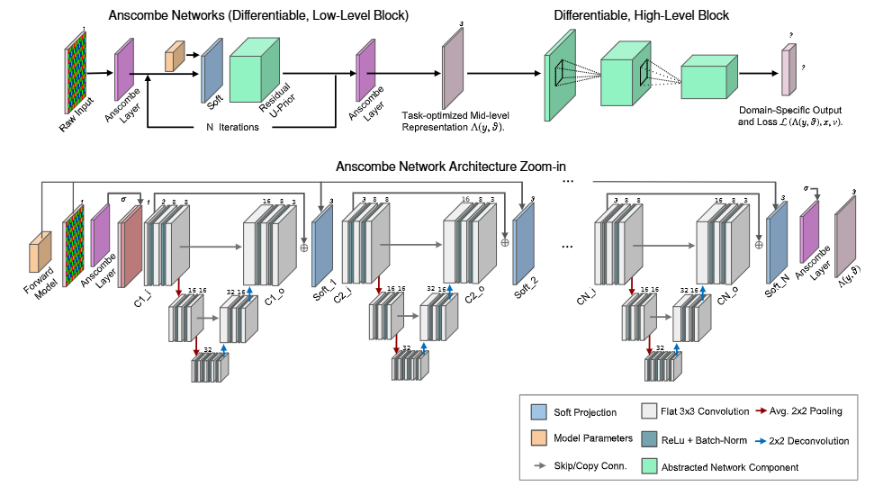
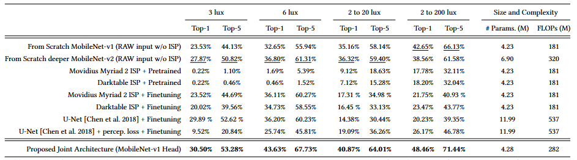
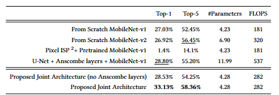
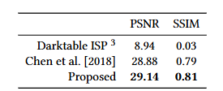
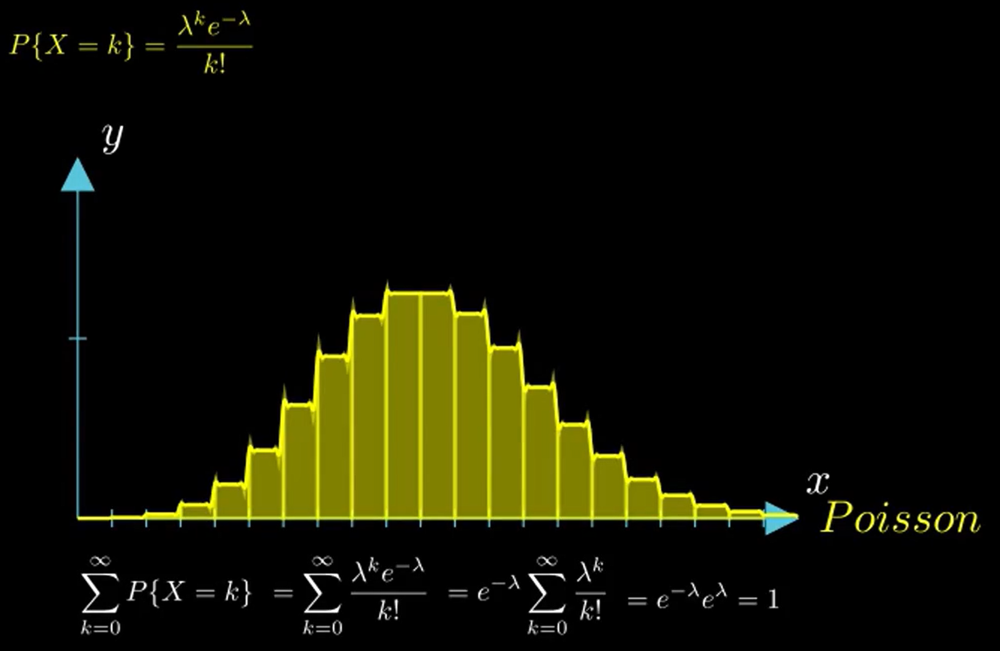

## Dirty Pixels: Towards End-to-End Image Processing and Perception

***本文核心研究背景***: 现实世界成像系统获得成像会受到噪声，光学畸变以及其他缺陷的影响，这些成像过程中的瑕疵会使得人眼观看以及更高级别的高级感知任务进行处理图像也会具有挑战性。**目前**，传统的摄像机通过将成像与高级任务（比如特征提取，分类，跟踪，融合）**区分开**来解决这个问题。**传统成像过程包括按照顺序对原始传感器测量数据进行一系列处理步骤（去马赛克，降噪，去模糊，色调映射和压缩等）进行优化来获得视觉上比较满意的图像，高级处理则包含特征提取、分类、跟踪和融合等步骤**。

***本文研究目标***提出一种end to end的可微架构，能够联合执行去马赛克、降噪、去模糊、色调映射和分类任务。该架构不需要基于感知图像质量的任何中间损失，并且以增加噪声和伪影为代价保留了精细细节。

***本文观点***
- 直接去除图像信号处理器（ISP），直接在原始测量数据上训练感知模型，但最终被证明在原始数据上训练现有的分类器其性能与经过传统ISP预处理的分类器相当。

***本文贡献点***
- 证明了，使用最先进的图像信号处理器（ISP）和在标准JEPG数据集上训练分类器的传统感知流程，在低光照条件下表现不佳。
- 提出了Anscombe networks，一种轻量级的神经相机图像信号处理器，用于马赛克和降噪，能够在不同相机架构和拍摄设置下通用。
  **以感知图像质量损失为训练目标时**，在低光成像的图像质量优化方面，能达到最优。
  **与分类网络联合训练时**，不管是从头训练还是微调，效果都比基于原始数据或者最先进的软硬件以及可学习ISP输出训练高级网络要好。
- 提出了一个根据手机相机校准的真实噪声和模糊模型数据集，以及一个带注释的噪声的原始捕获数据集。

### 相关工作
1. **噪声和模糊对高级网络的影响**（Chen等人发现训练兼具去噪和分类功能的模型能提高两个任务的性能，本文从头训练的模型与Chen等人的方法相似）
2. **相机图像处理流程**：
3. **传统图像处理流程在计算机视觉中的应用**
4. **领域自适应**

### 相机图像成像模型
**相机成像过程公式**

在相机成像过程中，使用以下公式描述成像过程：

\[
\begin{aligned} 
y_{x} & \sim \alpha \mathcal{P}\left(\sum_{c \in\{R, G, B\}} S^{c}\left(k_{c} * E_{c} x\right) / \alpha\right)+\mathcal{N}\left(0, \sigma^{2}\right) \\ 
\Leftrightarrow y_{x} & \sim \alpha \mathcal{P}(A x / \alpha)+\mathcal{N}\left(0, \sigma^{2}\right) \\ 
y & =I(x)=\Pi_{[0,1]}\left(y_{x}\right) 
\end{aligned}
\]

其中：
- \(x \in \mathbb{R}^{3N}\) 是向量化的潜在彩色图像， \(N\) 为像素数量，因为每个像素有红（\(R\)）、绿（\(G\)）、蓝（\(B\)）三个颜色通道信息，所以是 \(3N\) 维。
- \(y \in \mathbb{R}^{N}\) 是测量得到的原始图像，为 \(N\) 维向量。
- \(\alpha>0\) 是泊松分布参数，与曝光时间和传感器增益有关。
- \(\sigma>0\) 是高斯分布参数，表示噪声标准差。

算子和矩阵解释：
- \(E_{c}\)：从潜在彩色图像 \(x\) 中提取颜色通道 \(c\)（\(c\in\{R,G,B\}\)）的信息。
- \(k_{c}\)：颜色通道 \(c\) 中的镜头点扩散函数（PSF），描述镜头对光线的扩散作用，“\(*\)” 表示二维卷积算子，\(k_{c} * E_{c}x\) 模拟镜头模糊效果。
- \(S^{c}\)：对角下采样矩阵，对传感器彩色滤光片阵列上彩色滤光片 \(c\) 的空间下采样进行建模，定义为 \(S_{ii}^{c}=\begin{cases}1 & \text{如果像素 } t \text{ 具有彩色滤光片 } i \\ 0 & \text{否则} \end{cases}\)。
- \(\sum_{c \in\{R, G, B\}} S^{c}\left(k_{c} * E_{c} x\right) / \alpha\)：对各颜色通道进行操作后求和再除以 \(\alpha\)。
- \(\alpha \mathcal{P}\left(\sum_{c \in\{R, G, B\}} S^{c}\left(k_{c} * E_{c} x\right) / \alpha\right)\)：进行泊松分布处理。
- \(\alpha \mathcal{P}\left(\sum_{c \in\{R, G, B\}} S^{c}\left(k_{c} * E_{c} x\right) / \alpha\right)+\mathcal{N}\left(0, \sigma^{2}\right)\)：在泊松分布结果上添加高斯噪声，模拟传感器电子噪声。
- \(A\)：综合矩阵，是 \(\sum_{c \in\{R, G, B\}} S^{c}\left(k_{c} * E_{c} \right)\) 的简化表示。
- \(\Pi_{[0,1]}\left(y_{x}\right)\)：将结果投影到区间 \([0, 1]\) 上，得到最终成像 \(y = I(x)\)。

***具体解释***：
\[
\begin{aligned} 
y_{x} & \sim \alpha \mathcal{P}\left(\sum_{c \in\{R, G, B\}} S^{c}\left(k_{c} * E_{c} x\right) / \alpha\right)+\mathcal{N}\left(0, \sigma^{2}\right) \\ 
\end{aligned}
\]
1. 为什么要除以$\alpha$：泊松分布$\mathcal{P}\left(\lambda\right)$中$\lambda$是一个很重要的参数，表示在一定时间或空间内时间发生的平均次数。通过除以$\alpha$可以将一系列操作（颜色通道提取，卷积，空间子采样等）得到的信号值调整为合适的值，来准确描述光子到达的统计特性，

### 模型架构

模型架构如上所示，整合了通过联合学习得到的底层和高层处理单元，以原始传感器的彩色滤光片阵列（CFA）数据作为输入，并输出图像标签。

模型将底层模块(Anscombe 网络单元)建立在一中优化算法$\Lambda$的基础上，用于解决从带有噪声，单通道的，经过空间子采样的原始（RAW）测量数据中，重建出未受干扰的潜在中层表示的问题。和标准的卷积神经网络不通，**这个Anscombe layers 使得该方法和光照水平无关，并且展开的优化模型能够在不同的相机模型键实现泛化**，将联合重建和感知问题表示为一个双层优化问题：
\[\begin{array}{ll}
\underset{\vartheta, v}{\min} \mathcal{L}(\Lambda(y, \vartheta), x, v) \\
\text{s.t. } \Lambda(y, \vartheta)=\underset{x}{\text{argmin}} \mathcal{G}(x, y, \vartheta),
\end{array}\]

**公式解释**:
1. $\underset{\vartheta, v}{\min} \mathcal{L}(\Lambda(y, \vartheta), x, v)$ 表示外层优化的目标是找到合适的参数$\vartheta$和$v$，使得损失函数达到最小值，这里的$\mathcal{L}$表示一个综合的损失函数。
   - 其中$y$表示原始测量数据，$\Lambda(y, \vartheta)$表示由底层优化算法得到的多通道中层表示，反应了对原始数据的一种处理和特征提取。
   - $x$代表潜在的，理想的彩色图像，用于与$\Lambda(y, \vartheta)$进行比较，来衡量模型输出与真实情况的差异。
   - $v$表示更高层级模型的参数，表示可能使用高层及模型对中层表示$\Lambda(y, \vartheta)$进行进一步的处理和分析，比如分类任务。
2. 内层优化（约束条件）：$\underset{x}{\text{argmin}} \mathcal{G}(x, y, \vartheta)$表示要找到一个$x$（期望恢复的真实的潜在信号或图像），使得目标函数$G$要达到最小值。
   - 这里的目标函数$G$采用贝叶斯方法作为架构的主干，利用概率图像形成模型来估计潜在的三通道图像$x$，并且允许一种有原则的方式表达先验信息。贝叶斯模型假设$x$是从一个由$\theta$参数化的先验分布 $\Omega(\vartheta)$中抽取的。(详细理解可以见[扩展部分](#前置知识))
   - 迭代优化：通过不断地迭代更新对$x$的估计，使得在每一次迭代中，估计结果都朝着使目标函数（一般来说是后验概率的负对数）更小的方向发展。

#### Anscombe Networks
Anscombe Networks将图像重建视为一个统计估计问题，即从受损的观测数据中估计出一幅保留特征的中层图像。采用贝叶斯方法，将网络模型推导为一种最大后验概率（MAP）估计方法。

本文提出，一个未知图像$x产生观测值$y$的后验概率为:
\[P(x | y ; \vartheta)=\frac{P(y | A x) P(x ; \vartheta)}{\int_{x} P(y | A x) P(x ; \vartheta)}\]

在给定观测值$y$和模型参数$\vartheta$的情况下，$P(x ; \vartheta)$和$P(x ; \vartheta)$ 的函数形式是确定的，而$\int_{x} P(y | A x) P(x ; \vartheta)$是对所有可能的$x$进行积分，其结果只与观测值$y$、模型参数$\vartheta$以及$P(x ; \vartheta)$和$P(x ; \vartheta)$所遵循的概率分布有关，与具体要估计的$x$无关，所以最终积分为一个常数，**这一部分不懂**
最后，后验概率$P(x | y ; \vartheta)$与$P(y | A x) P(x ; \vartheta)$成正比，所以求最大后验概率时，可以直接最大化$P(y | A x) P(x ; \vartheta)$

### 实验部分

实验对比了直接使用RAW图从零开始训练的MobileNet-v1模型和MobileNet-v2模型，以及使用Movidius Myriad 2ISP和 Darktable ISP与预训练的分类模型以及经过微调的模型作对比，最后还和可学习的ISP做了对比

实验结果表明在各种光照条件下，Top-1和Top-5都是准确率都达到最佳。

如上表所示，如果使用感知损失函数，可以将图像恢复到不错的效果。
### 前置知识
**ISP** : 即图像信号处理器（Image Signal Processor），负责处理从传感器获取到的原始图像数据（Raw图），将其转换为可供后续使用的高质量图像。

**泊松分布** : 
而在给定的图像形成模型中，泊松分布被用于描述图像形成过程中不同噪声特性：
泊松分布是一种离散概率分布，用于在固定时间或空间内随机事件发生次数的概率，特点是事件发生的概率与事件或空间的大小成正比，并且事件之间相互独立。而在图像形成中，主要用于描述光子到达传感器的统计特性。

**贝叶斯模型**
贝叶斯模型在处理不确定性和利用先验信息方面具有独特优势。本文被用于从给定的观测数据（这里是有噪声、单通道、空间子采样的RAW测量数据y）中估计潜在的三通道图像$x$。
- 先验分布$\Omega(\vartheta)$
  - 定义与作用：先验分布$\Omega(\vartheta)$是在观察到任何数据之前，对潜在图像$x$的一种初始信念或假设。它由参数$\vartheta$来参数化。这个分布反映了对$x$可能取值的先验知识或预期。例如，如果我们知道图像通常具有一定的平滑性、特定的颜色分布或某种结构特征，这些信息可以通过先验分布来体现。通过引入先验分布，可以在数据不充分或存在噪声的情况下，对估计结果进行约束和引导，使估计更符合我们对问题的先验理解，从而提高估计的准确性和可靠性。
  &nbsp;
  - 举例说明：假设我们要估计的是自然场景图像，根据经验我们知道自然图像中相邻像素之间的颜色和亮度变化通常是比较平滑的，很少会出现突然的剧烈变化。先验分布$\Omega(\vartheta)$就可以被设计成偏好具有这种平滑特性的图像$x$。具体来说，它可能会给那些像素值变化平缓、符合一定统计规律（如符合某种高斯分布或其他已知的图像统计模型）的图像$x$赋予较高的概率，而给那些像素值突变、不符合平滑特性的图像赋予较低的概率。这样，在根据观测数据$y$来估计$x$时，先验分布就会引导估计结果朝着更符合自然图像平滑特性的方向发展。

**最大后验概率MAP**
最大后验概率是一种在贝叶斯统计中用于估计未知参数或变量的方法
- 原理：在给定观测数据的情况下，找到使后验概率最大的参数值或变量值。结合了先验知识和观测数据来进行估计。
- 在图像重建中，可以利用MAP估计从有噪声的观测图像$y$中恢复出原始的潜在图像$x$。通过选择合适的先验分布$\Omega(\vartheta)$个噪声分布$\omega(Ax)$，以及相应的模型参数，可以使重建的图像在保留特征的同时，尽可能地接近真实图像。

- ***先验概率***：在考虑观测数据之前，根据以往的经验、知识或假设对某个事件发生的概率所做的估计。反映了对时间初始认知，不依赖于当前的观测数据。
- ***后验概率***：在观测到数据之后，根据观测数据对某个事件发生的概率进行重新评估和更新得到的概率。结合了先验概率和观测数据所提供的信息。

