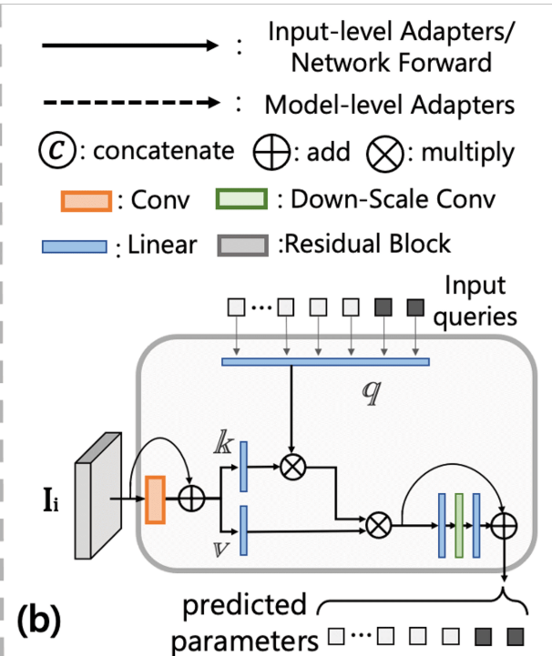

## RAW-Adapter: Adapting Pre-trained Visual Model to Camera RAW Images

**本文核心研究背景**: sRGB图像是预训练视觉模型的主要选择，主要有易于获取，高效存储两个有点。而RAW图像在现实世界中各种光照条件下都能保留丰富的物理信息。目前大部分针对基于RAW数据的计算机视觉任务，往往采用将图像信号处理器（ISP）与后端网络相结合的方法，忽略了ISP各阶段与后续网络之间的交互能力。

***本文研究目标***: 提出一个通用的适配器框架，使预训练的sRGB模型适配于相机RAW数据。

***本文观点***:
1. 与sRGB图像相比，由相机传感器直接获取的RAW图像包含了丰富的信息，这些信息没有收到图像信号处理（ISP）的影响或者压缩，并且由于其图像强度与相机接收到到的辐射能量之间存在线性相关性，还提供了一些噪声分布等有物理意义的信息。
（**图像强度Image Intensity可以理解为图像亮度，表示图像中每个像素点所具有的明亮程度或强度值，与接收到的辐射能量成线性关系，能更准确地记录场景中的光线信息，为后续的图像处理和分析提供丰富的原始数据。**）
&nbsp;

2. 目前计算机视觉的各种预训练模型的主要选择是sRGB图像，而sRGB图像是通过图像信号处理器(ISP)处理流程从相机的RAW数据中生成**如下图**。但是大部分公司的ISP是黑箱操作，而且目的是生成能够提供更优质视觉体验的图像。
  **某些情况下，直接使用这种面向人类视觉的ISP，效果可能比直接使用RAW数据还要差**

&nbsp;
3. 目前的主要方法依然将ISP和后端神经网络视为两个独立的模块，**缺乏两个独立模型之间的交互能力**，比如使用传统ISP模块设计**如图b**，使用神经网络代替ISP部分**如图c**（**Dirty Pixels**）。

4. 直接使用RAW数据从头开始训练计算机视觉模型比直接利用在sRGB图像上进行预训练的模型效果要差的多。如下图，黄线表示从头开始在RAW数据集上开始训练，紫线表示在ImageNet数据集上训练，蓝线表示在COCO数据集上训练。
  
  感觉论文这里不严谨，ImageNet数据集包含超过1400万张图片，RAW数据集肯定没有这么大，横坐标是epoch，这样怎么能比较呢？

***本文贡献点***:
1. 提出了RAW-Adapter，与先前在输入层面采用复杂图像信号处理器（ISP）或者更深层神经网络的方法不同。RAW-Adapter简化了输如阶段，并且在模型层面增强了ISP与后续网络之间的连接性。
2. 精心设计了输入适配器，整合了QAL(自适应学习)和隐式神经表示（INR）技术来优化ISP的关键参数。
3. 在不同光照场景的检测和分割实验都达到了SOTA性能。

****

### 相关工作
1. Image Signal Processor(图像信号处理器)
   - 传统的ISP
   - 结合深度学习的ISP。利用深度学习网络来代替传统的ISP处理流程
   - 将sRGB图像转换为RAW图像（后面的数据集制作应该就是用这种方法）
2. Computer Vision based On RAW data（基于RAW数据的计算机视觉）
   - 直接在RAW图像上执行视觉任务
   - ISP与后端计算机视觉模型相结合
3. Adapters in Computer Vision
   - 适配器让预训练模型快速适应下游任务

****

### 模型架构

总的来说，模型分为Input-level Adapters和Model-level Adapters。图中左侧部分，实线表示输入级适配器，虚线表示模型级适配器。

**Input-level Adapters**
输入级适配器主要分为4个部分， $\mathbb{P}_K$, $\mathbb{P}_M$, $\mathbb{L}$以及$\mathbb{M}$。
- $\mathbb{P}_K与\mathbb{P}_M$：
  这里采用自适应学习（QAL）来估计ISP各个阶段的关键参数。QAL策略的灵感源自之前的Transformer模型。如图所示：

输入图像$I_i(i \in (1,2))$经过两个下采样卷积模块来生成特征，然后特征经过两个线性层生成注意力模块的key和value，query则是一组可以动态学习的参数，然后，ISP的参数可以表示为：
\[parameters = F F N (softmax(\frac{q \cdot k^T}{\sqrt{d_k}}) \cdot v)\]
其中$FFN$表示前馈神经网络，包含两个线性层和一个激活层，一共有$\mathbb{P}_K和\mathbb{P}_M$两个QAL来预测不同部分的参数。
**$\mathbb{P}_K$预测合适的用于去噪的高斯核$k$，关键参数是高斯核的长轴短轴$r1和r2$，以及一个增益比$g$来适应不同光噪场景**。像素$(x,y)$处的高斯核$k$为：
\[k(x, y)=\exp(-(b_0x^2 + 2b_1xy + b_2y^2))\] 
其中：
\[b_0 = \frac{\cos(\theta)^2}{2r_1^2}+\frac{\sin(\theta)^2}{2r_2^2}\]
\[b_1 = \frac{\sin(2\theta)}{4r_1^2}((\frac{r_1}{r_2})^2 - 1)\]
\[b_2 = \frac{\sin(\theta)^2}{2r_1^2}+\frac{\cos(\theta)^2}{2r_2^2}\] 
总的来说，$I_1$到$I_2$可以表示为：
\[
\begin{aligned} 
& P_{K}(I_{1}, q) \to k\{r_{1}, r_{2}, \theta\}, g, \sigma, \\ 
& I_{2}'=(g \cdot I_{1}) \circledast k, \\ 
& I_{2}=I_{2}'+(g \cdot I_{1}-I_{2}') \cdot \sigma . 
\end{aligned}
\]
如图:

**\mathbb{P}_M用来预测闵可夫斯基距离的超参数$\rho$**，然后与白平衡矩阵相乘，得到$I_3$：
\[
\begin{align*}
& P_{M}(I_{2}, q) \to \rho, E_{ccm}, \\
& m_{i \in (r,g,b)} = \frac{\rho \cdot p_{avg}(I_{2}(i)^{\rho})}{\rho \cdot p_{avg}((I_{2})^{\rho})}, \\
& I_{3} = I_{2} \ast 
\begin{bmatrix}
m_{r} & &\\
& m_{g} &\\
& & m_{b}
\end{bmatrix}, \\
&I_{4} = I_{3} \ast E_{ccm}.
\end{align*}
\]
如图:

&nbsp;
- $\mathbb{L}$ 色彩处理过程：
  本文选择神经隐式三维查找表NILUT，如图：
  
  可以表示为：
  \[I_5(R',G',B')=\mathbb{L}(I_4(R,G,B))\]

**Model Adapters**
为了防止图像信号处理器各阶段$I_1$~$I_4$阶段的信息被忽略，模型适配器M负责将来自ISP各阶段的信息整合到网络主干中，这里基本就是一些简单的卷积和concat工作：
\[C(I_{1\sim4}) = C(c_1(I_1), c_2(I_2), c_3(I_3), c_4(I_4))\]
$c_i$表示卷积层，对应图中的部分:

图中的merge block详细结构如下图：

****

### 实验部分
没有什么特别要注意的，一个就是生成的不同光照情况下的数据集，一个就是消融实验：

给我一种主要是对不同光照条件有用的感觉...

****

### 前置知识
**RAW数据传输到sRGB的数码相机的成像过程**
(a). 预处理涉及一些预处理操作，如黑电平调整、白电平调整和镜头阴影校正。
(b). 降噪操作可消除噪声并保持图像的视觉质量，这一步骤与曝光时间和相机的 ISO 设置密切相关。
(c). 去马赛克用于从单通道的 RAW 数据重建出三通道的彩色图像，通过对拜耳（Bayer）图案中缺失值进行插值来实现，这依赖于彩色滤光阵列（CFA）中的相邻像素值。
(d). 白平衡模拟人类视觉系统（HVS）的颜色恒常性。自动白平衡（AWB）算法会估计传感器对场景光照的响应，并校正 RAW 数据。
(e). 色彩空间转换主要包括两个步骤，首先是将白平衡后的像素映射到未渲染的色彩空间（即 CIEXYZ），第二步是将未渲染的色彩空间映射到显示相关的色彩空间（即 sRGB），通常每个步骤都基于特定相机使用一个 3×3 矩阵 [16]。
(f). 颜色和色调校正通常使用三维和一维查找表（LUTs）来实现，同时色调映射还会压缩像素值。
(g). 锐化通过反锐化掩模或去卷积来增强图像细节。

****

### 可能可以改进的点
1. Implicit 3D LUT没有设计为图像自适应，而是从同一数据集中学到的固定的LUT，同一数据集中的不同图像仍然可能在信息和照明条件上具有重大变化。
   **结合之前看到的FastLLVE，也许可以有想通之处**
&nbsp;
2. Input-level Adapters总感觉哪里可以修改，总的来说，给我一种不统一的复杂感觉。本文保留了ISP的设计，用QAL（查询自适应学习）来估计ISP各阶段的关键参数。